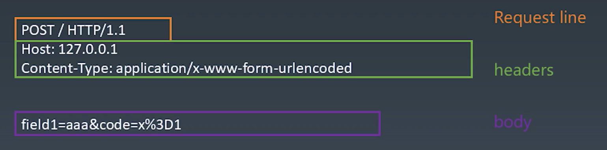
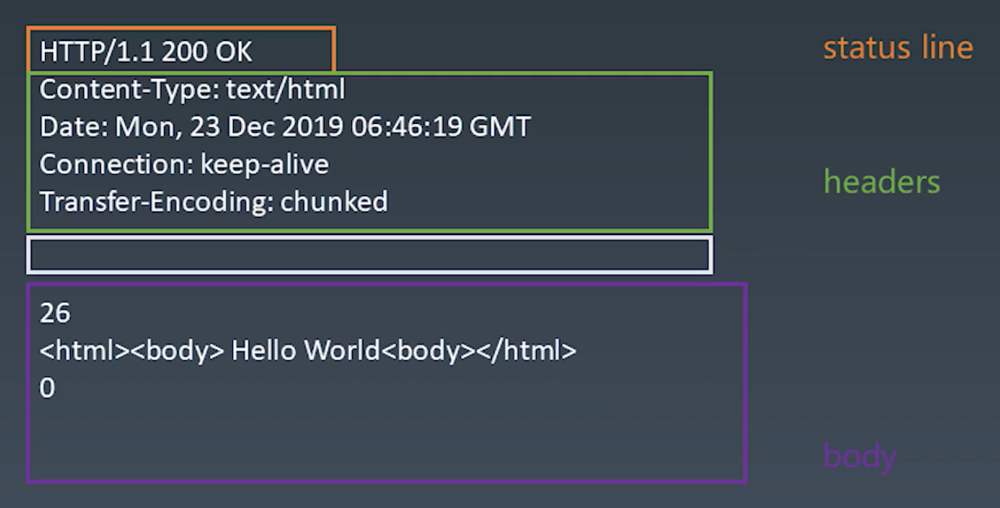

# 学习笔记

## 浏览器的工作原理

浏览器渲染流程


- 最后显示在屏幕上的是一张 Bitmap 图片
  - 计算机显示的一定是图片形式
  - 网页最后以 Bitmap 的形式传给显卡
- 真正的浏览器渲染流程比上图更加复杂

- 步骤
  1. 发送 HTTP 请求，解析 HTTP 响应
      - 读取 HTTP 响应中的 HTML 内容
  2. 解析（parse）HTML 文本，将 HTML 文本转化为 DOM Tree
  3. 计算当前 DOM 树相关的 CSS
  4. 通过上一步的计算，得到一棵带有样式（CSS）的 DOM Tree
  5. 对 DOM Tree 进行排版/布局，计算出每个 HTML 元素的位置
  6. 将 DOM Tree 渲染为一张图片，最后通过 OS 及外设显示内容

## 状态机 - 使用有限状态机处理字符串

### 有限状态机
- 每一个状态都是一个机器
  - 么个机器之前都是解耦的
    - 在利用状态机处理问题时，可以只关注当前状态机的逻辑，而忽略其他状态机中的逻辑
  - 每个机器都有相应的一系列功能
    - 计算
    - 存储
    - 输出
  - 所有机器接收的输入类型是一致的
  - 每个机器本身没有状态
    - 如果使用函数来代表一个机器的话，那么该函数是出函数：输出只与输入有关，且没有副作用
- 每一个机器都知道下一个状态
  - 摩尔状态机（Moore）：每个机器都有确定的下一个状态
    - 下一个状态是固定的，与输入无关
  - 米利型状态机（Mealy）：每个机器根据输入决定下一个状态

### 用 JS 实现米利型有限状态机

有限状态机

```javascript
// 设置状态机的起始状态
let currentState = initState;

while (input) {
    // Handle input
    currentState = currentState(input);
}
```

机器
```javascript
function state(input) {
    // Logic goes here ...

    return next;    // Return the next state
}
```
- 既然函数的返回值表示下一个状态，那么函数的返回值是下一个机器，即下一个表示机器的函数


## HTTP 请求

### ISO-OSI 七层网络模型

| ISO-OSI    |  Protocol   | Library |
| ---------- | :---------: | :-----: |
| 应用层     |    HTTP     | `http`  |
| 表示层     |    HTTP     |         |
| 会话层     |    HTTP     |         |
| 传输层     |     TCP     |  `tcp`  |
| 网络层     |  Internet   |         |
| 数据链路层 | 4G/5G/Wi-Fi |         |
| 物理层     | 4G/5G/Wi-Fi |         |


### TCP
- 以 Stream 的范式传输数据
  - 无明显分割单位
  - 保证先后顺序正确
- 端口
  - TCP 被计算机中的某个软件使用，“端口”用来识别正在使用 TCP 协议的软件
- NodeJS 中的库 -> `net`
- TCP 协议传输“数据包”
  - 每个包可大可小，取决于网络路径上各个硬件的传输能力
- TCP 协议根据 IP 地址进行路由
- 对应 IP 协议的底层库
  - NodeJS 中没有实现
  - C++：
    - `libnet`：构造 IP 包并发送
    - `libpcap`：从网卡抓取 IP 包


### HTTP

- 先由 Client 发起 Request，再由 Server 返回；并且每个 Response 对应一个 Request
- 文本型协议
  - 与二进制协议相对应
  - 意味着传输的内容都是字符串

#### HTTP Request



#### HTTP Response


