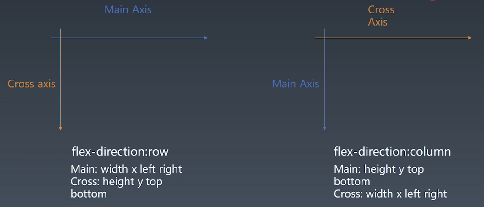
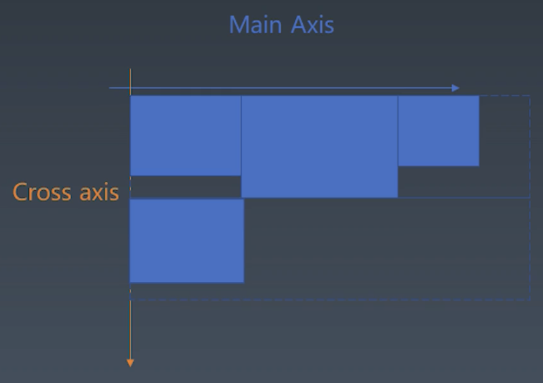

# 学习笔记

## 排版/布局（layout）

- 根据浏览器的属性进行排版

- 目标
  - 在 CSS 的基础上，通过排版的计算，得到一个带位置的 DOM 树
    - 为下一步真实的页面渲染打基础
- 概念
  - CSS 包含了三代排版技术
    - 正常流 -> 比较接近古典的排版策略
      - position
      - display
      - float
    - flex -> 比较接近人的自然思维和设计软件的思维模式
      - 比较容易实现
      - 功能相对完整
    - grid
      - 更强大
    - CSS Houdini -> 未来
- flex 排版
  - 不论纵排还是横排，都要收到某些 flex 属性的限制，需要在宽-高体系上进行抽象

    

    - 主轴的概念
      - 主轴是我们排版时的主要延伸方向
        - 例：在一号元素之后，二号元素会向那个方向进行排布？这个排布方向就是主轴方向
    - 交叉轴
      - 与主轴箱垂直的方向
  - 在排版开始时，通过 `flex-direction` 这个属性来设置主轴方向（`row`，`column`）
    - 减少了不必要的判断，可以更方便地访问主轴和交叉轴上相应的属性

- 实现

  > 整个实现过程/算法最终的目的是确定每一个元素的 `width`, `left`, `right`, `height`, `top`, `bottom`
  > 
  > 因为对于每个元素来说，确定了这六个属性的值，也就确定了它的位置（确定四个属性的值可以计算其他两个值）

  步骤
  - 抽象输入
    - 将 CSS 相关的属性抽象成与主轴和交叉轴相关的属性 
  - 将元素收集入行

    

    - 为计算元素位置做准备
    - flex 排班模式与正常流模式相似，当父元素的一行已经被子元素沾满时，就需要分行
      - 如果有 `no-wrap` 则可以强行将元素塞进一行
    - 要做的就是将 flex 容器的子元素（flex item）收集入行
  - 计算主轴
    - 在主轴方向，有些元素已经有 size 信息了，但是需要对带有 flex 属性的元素进行特殊处理
    - 需要找出所有 flex 元素
    - 把主轴方向的剩余尺寸按比例分配给这些元素
    - 若剩余空间为负数，所有 flex 元素为 0，等比压缩剩余元素
  - 计算交叉轴
    - 根据每一行中最大元素的尺寸计算行高
    - 根据行高 flex-align 和 item-align，确定元素的位置

## 绘制
  - 绘制单个元素
    - 绘制需要依赖一个图形环境
    - 绘制在一个 viewport 上进行
    - 与绘制相关的属性：background-color, border, background–image
  - 绘制 DOM
    - 递归调用子元素的绘制方法完成 DOM 树的绘制
    - 忽略一些不需要绘制的节点
    - 实际浏览器中，文字绘制是难点，需要依赖字体库
    - 实际浏览器中，需要图层处理