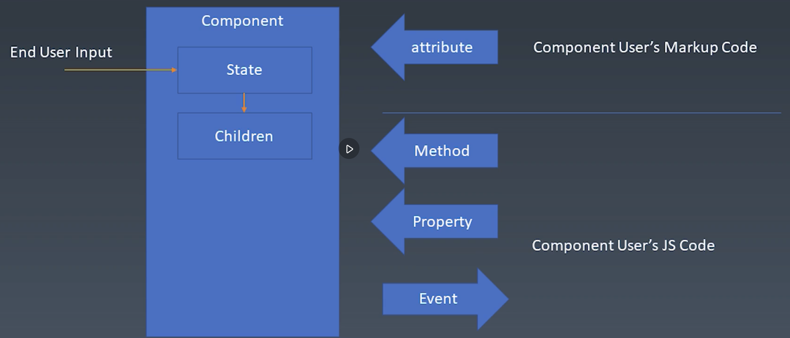
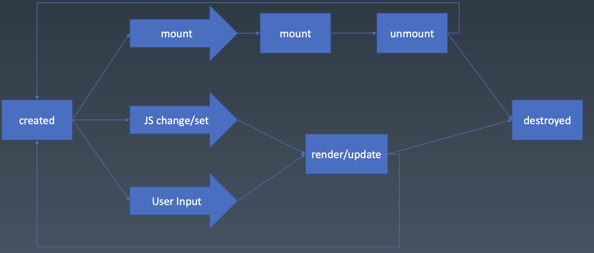

# 学习笔记

## 组件的基本概念和基本组成部分

组件的概念
– 组件区别于对象和模块，是特殊的对象或者特殊的模块
- 组件既是对象又是模块
- 组件与 UI 强相关
- 组件以树形结构来组合，有类似模板的配置能力

- 组件与对象
  - 对象
    - 一般认为有三大要素
      - Properties
      - Methods
      - Inherit （继承关系）
    - 可以通过三大要素来描述一个对象
  - 组件
    - 包含的语义要素更丰富
    - 除了三大对象之外
      - Attributes
        - 区别于 Properties
      - Config & State
      - Event 
        - 事件机制
      - Lifecycle
      - Children
        - 树形结构的必要性
          - 如果没有 children 就无法描述树形结构，也就限制了描述界面的能力
- 组件在对象基础上添加了很多新的语义要素，这使得组件非常适合描述 UI

- End User Input: 用户与组件的交互会改变组件的状态（State）
  - 其中组件状态的改变有时会影响到其子组件
- Attribute：通过 markup 设置；程序员通过 Attributes 更改组件的一些特征
- Properties：通过 JS 设置；程序员通过 Attributes 更改组件的一些特征
- Methods：复杂信息
- Event：设计组件的程序员向使用组件的程序员传递信息

- Attribute vs. Properties
  - Attribute 
    - 强调描述性
  - Property
    - 强调从属关系 

- 生命周期

- Children
    - Content 型 Children
      - 完整显示 Children 内容
    - Template 型 Children
      - Children 充当模板
      - 真正显示的内容由模板获得的数据决定

## 为组件添加 JSX 语法 (配置使用 JSX 的环境)
- install webpack
  - 打包所有依赖
- install babel-loader
  - 是 webpack 的一个 loader
- 创建 `webpack.config.js`
  - 是 NodeJS 模块
- install babel
  - 将新版本的 JS 编译成旧版本的 JS -> 可以在更多的老版本浏览器中运行
  - jsx is a plugin in babel
  - `npm install --save-dev @babel/core @babel/preset-env`
- install babel plugin
  - `npm install --save-dev @babel/plugin-transform-react-jsx`
    - For writing JSX in JS files

## JSX 的基本使用方法
- webpack 认为在运行时会有一个函数来处理 JSX 语法，webpack 将 JS 文件中的 JSX 语法翻译成对那个函数的调用。
  - 通过改变该函数的实现，可以改变 JSX 的语义

- Tag name 如果是大写，则会被处理为 JS class

## 轮播组件
